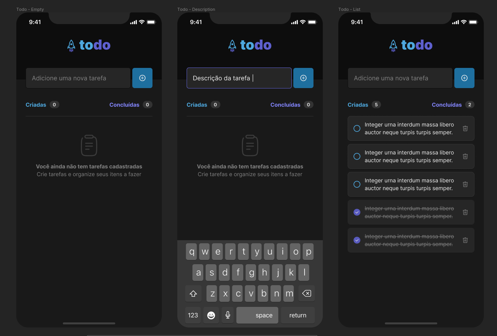

## **💻** Projeto
Primeiro desafio da trilha de React Native da escola Rockteseat, onde foi desenvolvido uma aplicação de controle de tarefas no estilo to-do list, que contém as seguintes funcionalidades:
- Adicionar uma nova tarefa
- Marcar e desmarcar uma tarefa como concluída
- Remover uma tarefa da listagem
- Mostrar o progresso de conclusão das tarefas

Uma aplicação simples com o intuito de praticar os conceitos de:
- Estados
- Imutabilidade do estado
- Listas e chaves no React Native
- Propriedades
- Componentização

<p align="center">
  
</p>

## 🚀 Tecnologias utilizadas

- [Expo](https://expo.dev/)
- [Typescript](https://www.typescriptlang.org/)
- [ReactJS](https://pt-br.reactjs.org/)

## **🚀** Como Executar

Antes de baixar o projeto você vai precisar ter instalado na sua máquina as seguintes ferramentas:

- [Git](https://git-scm.com/)
- [NodeJS](https://nodejs.org/en/)
- [NPM](https://www.npmjs.com/)
- [Expo (para emular na plataforma)](https://expo.dev/)

Segue os comandos para baixar e executar o projeto na sua máquina:

```bash
## Clone o projeto em sua máquina
git clone https://github.com/jose-rgb/toDoList

# Acessar o projeto no terminal
$ cd toDoList

# Instalar as dependências
$ npm install

# Executar o servidor em modo de desenvolvimento
$ npm run start

# Acessar o expo no emulador desejado